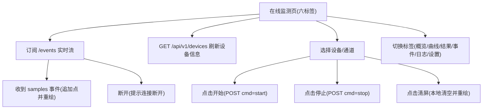

## 1. Product Overview

“在线监测”用于在浏览器中实时查看 GC 主板上传的曲线数据，并在需要时下发开始/停止命令。
前端界面风格需与您提供的截图一致（顶部六标签、卡片/表格/曲线布局与配色），并兼容现有 Edge Collector 的 `127.0.0.1:8080` 实时数据接口（SSE + HTTP）。

## 2. Core Features

### 2.1 Feature Module

在线监测需求由以下页面组成：

1. **在线监测页（六标签）**：顶部六标签导航（概览/曲线/结果/事件/日志/设置）、卡片化控制区与信息区、实时曲线展示、结果表格、调试状态信息；保持 8080 实时接口不变。

### 2.2 Page Details

| Page Name  | Module Name  | Feature description                                                                                                                                            |
| ---------- | ------------ | -------------------------------------------------------------------------------------------------------------------------------------------------------------- |
| 在线监测页（六标签） | 顶部六标签导航      | 提供 6 个顶栏标签用于切换视图：**概览 / 曲线 / 结果 / 事件 / 日志 / 设置**。切换标签不应中断 8080 SSE 订阅（除非用户显式断开/刷新）。标签栏样式、间距、配色与截图保持一致；当前激活标签高亮。                                                |
| 在线监测页（六标签） | 视觉与布局一致性     | 使用与截图一致的“浅底色 + 白色卡片”视觉：主要内容以卡片承载（控制卡、曲线卡、表格卡）。表格采用深色表头+浅色行分隔；曲线区域与表格并列布局（宽屏）或上下堆叠（窄屏）。                                                                         |
| 在线监测页（六标签） | 概览视图（设备状态）   | 拉取并展示设备在线列表（仅展示 `GC...` 设备）。显示每台设备的 connected/lastSeen/lastCmd/143 次数（如有）等关键字段；支持选择“当前设备”，选择后影响其他视图默认展示对象。                                                     |
| 在线监测页（六标签） | 曲线视图（控制与状态）  | 显示连接/在线状态。选择设备（仅 `GC...`）。选择 Channel（0\~3）。配置 Y 轴下限/上限。配置“采集时间(min)”与“满屏时间(min)”。提供“开始/停止/清屏”按钮；当后端关闭控制（如 allowControl=false 或 canStart22=false）时禁用开始/停止并提示原因。 |
| 在线监测页（六标签） | 曲线视图（实时曲线）   | 以折线方式实时绘制当前设备+通道的采样点。支持按“满屏时间”滚动窗口展示（超过窗口自动裁剪旧点）。支持清屏（清空当前设备+通道缓存点并重绘）。支持手动 Y 轴上下限；当开启“峰高自适应”时根据当前窗口 min/max 自动更新 Y 轴范围。                                       |
| 在线监测页（六标签） | 曲线视图（辅助信息）   | 显示当前通道运行时间（min）与最新值（pA）。提供“峰高自适应”勾选项。提供“谱图名称”输入框（仅做前端记录/展示用）。                                                                                                  |
| 在线监测页（六标签） | 结果视图（表格）     | 以表格形式展示：名称、含量(mg/m³)。默认至少包含 3 行：总烃、甲烷、非甲烷总烃；无数据时显示 “-”。（如后端未来提供结果数据，前端按字段映射更新单元格）。                                                                             |
| 在线监测页（六标签） | 事件视图（最小事件流）  | 展示 SSE 中与设备相关的事件摘要（如 device/samples 的到达时间、deviceId、channel 等最小字段），用于判断“是否有流量/是否有数据块”。                                                                          |
| 在线监测页（六标签） | 日志视图（调试状态）   | 展示当前设备统计：lastCmd、Cmd=143 次数、lastSeen/last143 距离当前秒数、control 开关状态、以及当前曲线 elapsed/fullWindow 信息；用于联调定位“设备在线但曲线为空”等问题。                                            |
| 在线监测页（六标签） | 设置视图（本地显示参数） | 管理仅影响前端展示的默认参数（如默认满屏时间、默认 Y 轴范围、是否默认自适应、是否自动选择最近活跃设备）；建议持久化到 localStorage，刷新后保持。                                                                               |

## 3. Core Process

### 用户操作流

1. 你打开“在线监测页”，前端自动订阅 `http://127.0.0.1:8080/events` 并周期性刷新设备列表 `GET /api/v1/devices`。
2. 顶部六标签默认进入“曲线”或“概览”（以截图交互为准）；当检测到 `GC...` 设备在线时，设备下拉框出现可选项。
3. 你选择设备与 Channel，并按需调整 Y 轴上下限、采集时间/满屏时间、是否启用峰高自适应。
4. 你点击“开始”：前端先清空当前设备+通道的曲线缓存并重绘，然后向 8080 接口下发 start 命令；随后持续接收实时采样点并绘制曲线。
5. 你点击“停止”：前端下发 stop 命令（停止发送不影响历史显示）。
6. 你点击“清屏”：仅清空当前设备+通道已接收的曲线数据并重绘。
7. 你在顶部切换标签查看“结果/事件/日志/设置”，默认不影响 SSE 连接与当前选中设备；返回“曲线”后仍可继续绘制。
8. 若 SSE 断开或设备离线，页面状态提示“连接断开”，并保持最后一次曲线数据（不再新增点）。

### 页面导航流程图

