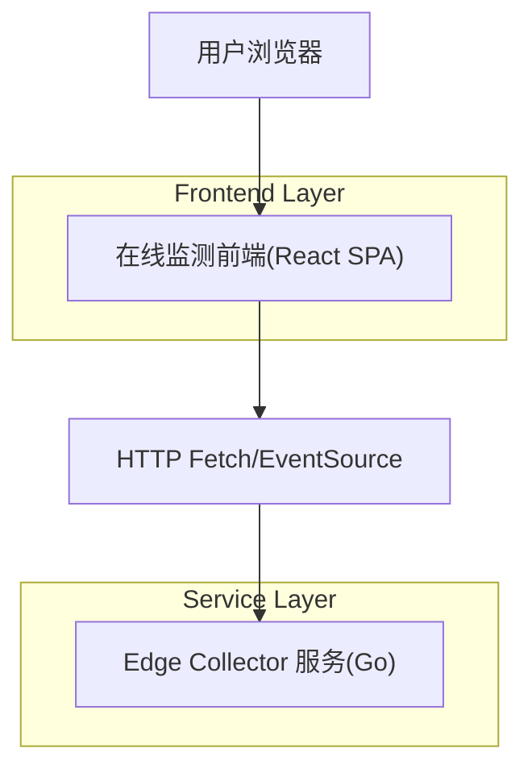

## 1.Architecture design


## 2.Technology Description
- Frontend: React@18 + TypeScript + vite + tailwindcss（或等价 CSS 方案）
- Backend: None（复用现有 Edge Collector，作为外部实时数据服务）

## 3.Route definitions
| Route | Purpose |
|---|---|
| /online/curve | 在线监测曲线页：设备选择、开始/停止、实时曲线与结果表 |

## 4.API definitions（对接现有 8080 实时接口）

### 4.1 实时事件流（SSE）
```
GET http://127.0.0.1:8080/events
GET http://127.0.0.1:8080/events?deviceId=GCxxx   (可选过滤)
```
事件为 `text/event-stream`，每条消息为 `data: <json>\n\n`。

TypeScript 类型建议：
```ts
type DeviceEvent = {
  type: "device";
  deviceId: string;
  at: string; // ISO time
};

type SamplesEvent = {
  type: "samples";
  deviceId: string;
  at: string; // ISO time
  channel: number; // 0..3
  dtS: number;     // 采样间隔(秒)
  t0S: number;     // 本次数据块起始时间(秒)
  values: number[];
};

type RealtimeEvent = DeviceEvent | SamplesEvent;
```

### 4.2 设备列表/状态
```
GET http://127.0.0.1:8080/api/v1/devices
```
响应字段（前端只使用必要字段）：
```ts
type DeviceSummary = {
  deviceId: string;
  lastSeen: string; // ISO time
  lastCmd: number;
  cmdCounts: Record<string, number>; // key 为 cmd 数字字符串，如 "143"
  last143: string;  // ISO time
  connected: boolean;
  allowControl: boolean;
  canStart22: boolean; // true 时允许发送 start/stop
};
```

### 4.3 下发控制命令（开始/停止）
> 注意：后端可能通过环境变量关闭控制（allowControl=false）；此时前端需禁用按钮并提示。

```
POST http://127.0.0.1:8080/api/v1/devices/{deviceId}/cmd?name=start&channel=0
POST http://127.0.0.1:8080/api/v1/devices/{deviceId}/cmd?name=stop&channel=0
```
成功响应示例：
```json
{ "ok": true, "cmd": 22 }
```
失败响应示例：
```json
{ "error": "control disabled: set EDGE_ALLOW_CONTROL=1" }
```
